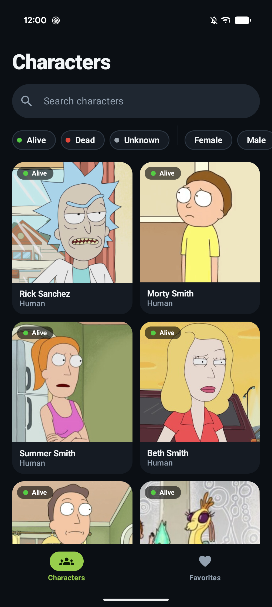
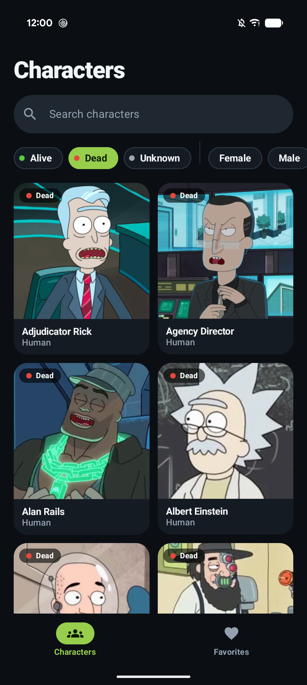
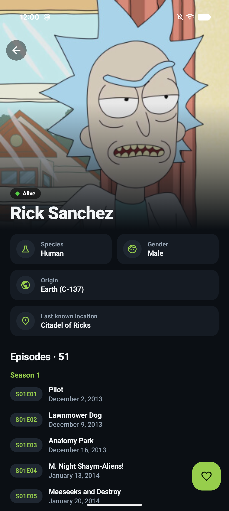
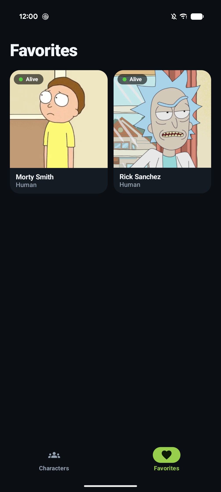

# Napptilus - Rick and Morty Challenge

<p align="center">
  
</p>

An Android app to browse every character of *Rick and Morty* using the public
[Rick and Morty API](https://rickandmortyapi.com/). Scroll the full, paginated catalogue, search
by name, filter by status and gender, open any character to see their profile and every episode
they appear in, and keep your favourites locally. Built with Kotlin and Jetpack Compose,
following Clean Architecture with a reactive, `Flow`/`StateFlow`-driven UI layer.

---

## 📸 Screenshots

| Characters | Filtered by status | Character detail | Favorites |
|---|---|---|---|
|  |  |  |  |

---

## 📚 Table of Contents

- [Screenshots](#-screenshots)
- [Features](#-features)
- [Tech Stack & Architecture](#-tech-stack--architecture)
- [Architectural & Design Decisions](#-architectural--design-decisions)
- [Project Structure](#-project-structure)
- [Requirements](#-requirements)
- [Building & Running](#-building--running)
- [Running Tests](#-running-tests)
- [What I'd Do Next](#-what-id-do-next)
- [AI-Assisted Development](#-ai-assisted-development)

---

## ✨ Features

| Challenge ask | Where it lives |
|---|---|
| List every character | Paginated 2-column (adaptive) image grid — `presentation/search` |
| Character detail | Hero image, status, species, gender, origin, location, type + episodes grouped by season — `presentation/detail` |
| Search / filter | Debounced name search + status and gender filter chips, combinable |
| Cache network images | Coil memory + disk cache (`RickAndMortyApp`) |
| Response caching | OkHttp disk cache with per-endpoint TTLs **and** an offline fallback (`data/remote`) |
| Error handling | Typed `DataError` → localizable `UiText`; full-screen, inline (next page) and per-section errors |
| Tests | 104 JVM unit tests (MockK, Turbine, coroutines-test, Koin verify) + 25 instrumented tests (Room DAO + Compose UI) |
| Be creative | Shared-element image transition list → detail, favourites (Room, offline) |

---

## 🛠️ Tech Stack & Architecture

* **Language:** Kotlin 2.2.10
* **UI:** Jetpack Compose (BOM 2026.02.01), Material 3, Navigation Compose, shared-element transitions.
* **Architecture:** Clean Architecture (`core` / `data` / `domain` / `presentation` / `di`) in a
  single Gradle module, MVVM presentation layer with unidirectional data flow.
* **Dependency Injection:** Koin 4.0.0.
* **Networking:** Retrofit 2.11.0 + OkHttp 4.12.0 + kotlinx.serialization.
* **Persistence:** Room 2.7.0 (favourites).
* **Pagination:** Paging 3 (3.3.5).
* **Image loading:** Coil 2.7.0.
* **Async:** Kotlin Coroutines & Flow.
* **Testing:**
  * **Unit tests:** JUnit 4, **MockK**, Turbine, `kotlinx-coroutines-test`, Koin's `verify()`.
  * **UI/Instrumentation tests:** Compose UI test, AndroidX Test, in-memory Room.
  * Shared fakes and builders (`FakeCharacterRepository`, `FakeFavoritesRepository`, `aCharacter()`...)
    live in a `testFixtures` source set reused by both unit and instrumentation tests.

---

## 🏛️ Architectural & Design Decisions

### 1. Single module, Clean Architecture via packages

The project is one Gradle module with the layers expressed as packages. The dependency rule is
kept by construction: `domain` has no Android/Retrofit/Room imports (only Paging's `PagingData`
type, a pragmatic exception since it's the lingua franca for paginated streams), `presentation`
only talks to use cases, and `data` implements the domain repository interfaces. The split to
`:core:*` / `:feature:*` modules is mechanical from here if the app grows (each `presentation`
subpackage becomes a feature module), but at this size it'd be build overhead with no payoff.

### 2. SOLID in practice

* **S** — one use case per business operation; interceptors each own one concern (freshness vs.
  offline fallback); the memory cache is its own class instead of repository state.
* **O** — new error types only need a `DataError` entry plus a `asUiText()` mapping; the rest of the
  pipeline (`safeApiCall`, `DataException`) is untouched.
* **L / I** — small repository interfaces (`CharacterRepository`, `FavoritesRepository`) that fakes
  substitute transparently in every test.
* **D** — ViewModels depend on use cases, use cases on repository abstractions, and Koin wires the
  concrete implementations at the edge (`di/`).

### 3. Search & filtering as one reactive pipeline

`SearchViewModel` combines three `StateFlow`s (query, status, gender) into a single
`CharacterFilter`, then `flatMapLatest` into a new `Pager` and `cachedIn(viewModelScope)`.
Only **typing** is debounced (400 ms); clearing the field or tapping a chip is a deliberate action
and refreshes immediately. `distinctUntilChanged` avoids refetching for `"rick"` → `"rick "`.
The grid keeps the previous results visible (with a thin progress bar) while a new filter loads,
instead of flashing a full-screen spinner.

### 4. Handling the API's quirks in the data layer

The UI never sees them:

* A search with no matches answers **HTTP 404** instead of an empty list →
  `CharacterPagingSource` maps it to an empty last page (the "No characters found" state), not an error.
* `GET /episode/1` returns an **object** but `GET /episode/1,2` returns an **array** → the app uses
  the bracket form `episode/[ids]`, which always returns an array, and fetches all of a
  character's episodes in **one request**.
* The literal string `"unknown"` for places is normalised to `null` so the UI shows one localized
  fallback; episode URLs are reduced to ids; unexpected enum strings fall back to `UNKNOWN`.

### 5. Performance: three cache levels

1. **In-memory character cache** (`CharacterMemoryCache`, LRU of 500). The list endpoint already
   returns the full character, so the paging source stores every page and opening a detail from
   the list costs **zero** requests. Because the repository answers without suspending, detail
   content is ready on the first frames — which is also what makes the shared-element
   transition line up.
2. **HTTP cache** (OkHttp, 20 MB). `CacheControlInterceptor` sets per-endpoint lifetimes (list 1 h,
   character 1 day, episodes 7 days — aired episodes never change) instead of relying on
   whatever the CDN sends. `OfflineCacheInterceptor` retries a failed GET with
   `only-if-cached, max-stale=7d`, so anything seen before still works **offline**; if nothing is
   cached, the original error propagates to the normal error UI.
3. **Image cache** (Coil memory 25% + disk 2%). The same memory-cache key is used in the grid and
   the detail hero, so the hero is drawn instantly from memory.

Plus: `LazyVerticalGrid` with stable keys and `contentType`, a prefetch distance of half a page,
and adaptive columns (2 on phones, more on tablets/landscape).

### 6. Independent sections on the detail screen

The character and its episodes are separate `StateFlow`s combined with the favourite status.
An episodes failure never hides a character that loaded fine: it shows an inline error with its
own retry (`retryEpisodes()`), while `loadInfo()` retries the whole screen.

### 7. Error handling end-to-end

`Throwable` → `DataError` (typed, in `core/data`) → `Result<T, DataError>` → `UiText` (resource
based, localizable, and assertable in unit tests without a Context). Paging, which can only carry
a `Throwable`, transports it inside a `DataException`. `CancellationException` is always rethrown.
Favourite writes report failures through a one-shot `Channel` rendered as a snackbar.

### 8. Offline-first favourites

Room stores the **whole character snapshot**, not just an id, so the Favourites tab works without
network, and `GetCharacterDetailUseCase` falls back to that snapshot when the character can't be
fetched — a saved favourite is always viewable, even offline after a restart. `observeAll()` /
`observeIsFavorite()` are reactive, so the heart and the list stay in sync automatically.

### 9. Shared-element transition without coupling screens to navigation

The `SharedTransitionScope` and the destination's `AnimatedVisibilityScope` are provided through
nullable `CompositionLocal`s. `Modifier.sharedCharacterImage(id)` is a no-op without them, so
screens stay usable in isolation (previews, UI tests) and don't take animation parameters.
Tab switches are deliberately not animated, which also avoids a character present in both grids
flying across the screen.

---

## 🗂️ Project Structure

```
app/src/main/java/com/mutissx/napptilusrickandmorty/
├── core/            # Result, DataError, safe calls, error mappers, UiText
├── data/
│   ├── cache/       # CharacterMemoryCache
│   ├── local/       # Room: AppDatabase, FavoriteCharacterDao/Entity
│   ├── mapper/      # DTO/Entity ⇄ domain
│   ├── paging/      # CharacterPagingSource
│   ├── remote/      # RickAndMortyApi, DTOs, cache interceptors
│   └── repository/  # CharacterRepositoryImpl, FavoritesRepositoryImpl
├── di/              # Koin modules
├── domain/          # Models, repository contracts, use cases
├── presentation/    # search/, detail/, favorites/, components/, navigation/
└── ui/theme/        # Colours, typography, shapes
app/src/testFixtures # Fakes + builders shared by unit and instrumentation tests
```

---

## ✅ Requirements

* Android Studio with AGP 9.3 / Kotlin 2.2.10 support
* JDK 17+ (the Android Studio bundled JBR works)
* Android SDK with **API 37** (compile/target 37, minSdk 30)
* No API key is needed — the Rick and Morty API is public. `BASE_URL` is a `buildConfigField`.

---

## 🏗️ Building & Running

```bash
./gradlew assembleDebug      # build
./gradlew installDebug       # install on a connected device/emulator
./gradlew assembleRelease    # R8-minified build (keep rules in src/main/keepRules)
```

On Windows, use `gradlew.bat` instead of `./gradlew`. No signing config is set up, so
`assembleRelease` produces an **unsigned** APK. Sign it (or use the debug build) before installing.

---

## 🧪 Running Tests

```bash
./gradlew testDebugUnitTest            # 104 JVM unit tests
./gradlew connectedDebugAndroidTest    # 25 Room DAO + Compose UI tests on a device/emulator
```

`KoinModulesTest` statically verifies the whole dependency graph, catching DI wiring mistakes at
test time instead of as a launch crash.

---

## 🤖 AI-Assisted Development

AI tools were used during development for writing tests, some UI components and previews,
checking the HTTP caching strategy, code review and these docs. Everything they produced was reviewed
before being committed. See [`AI_USAGE.md`](AI_USAGE.md) for which tools were used and for what.

